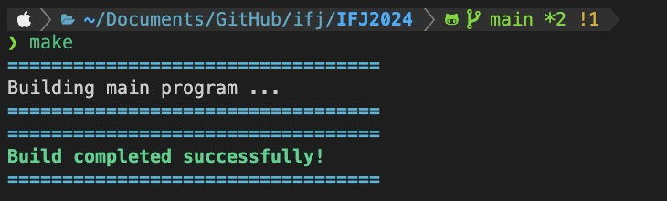
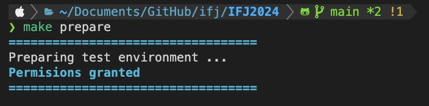
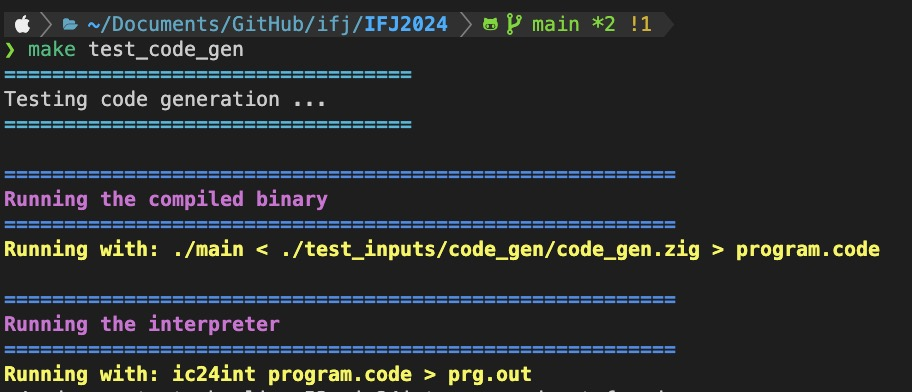
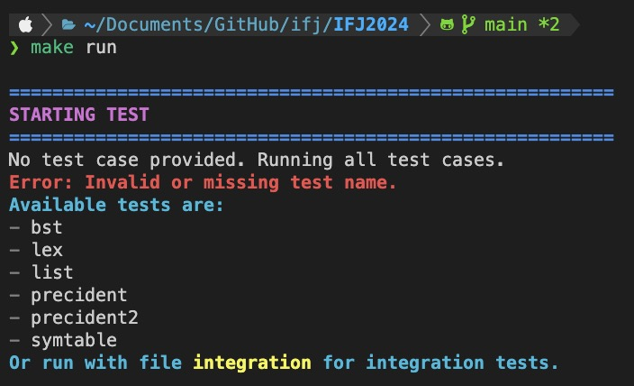
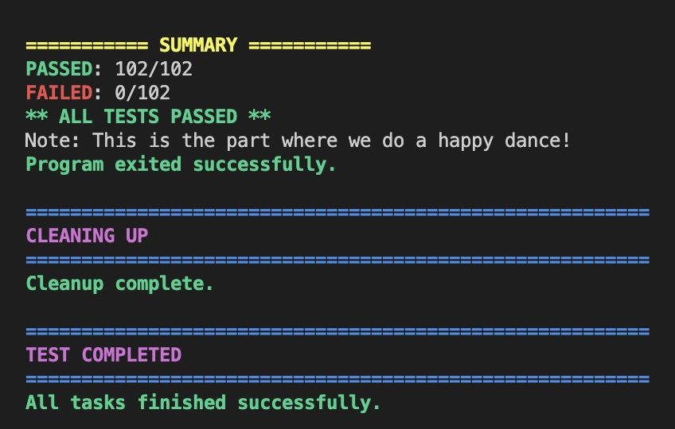
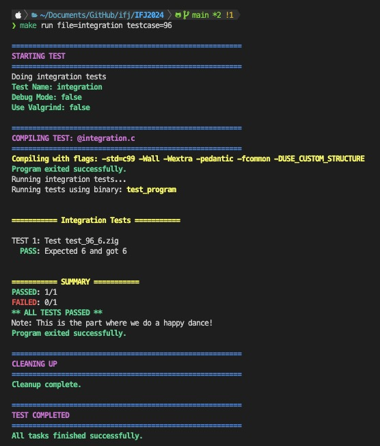
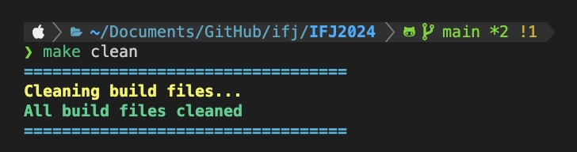
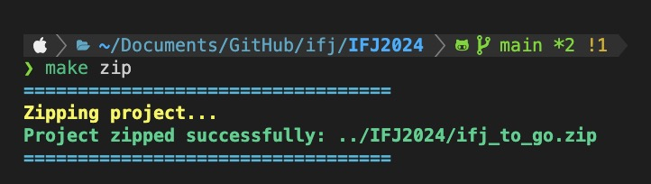
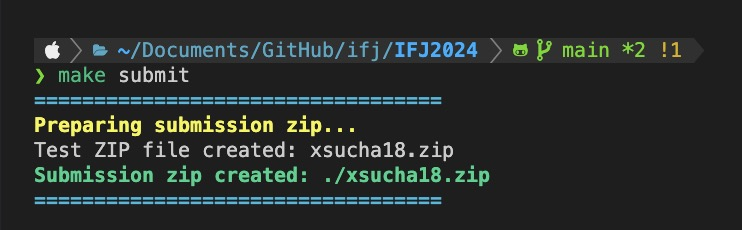
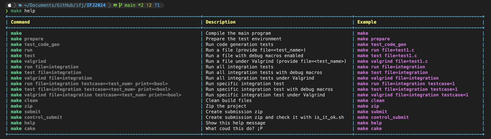

# IFJ 2024

Project for IFJ 2024


Objective: Create a compiler for the language IFJ2024

## Authors

- **Marek Sucharda** (xsucha18)
- **Veronika Svobodová** (xsvobov00)
- **Martin Mendl** (x247581)
- **Vanesa Zimmermannová** (x253171)

## Description

This project is a translator for IFJ24 to IFJcode24.

## Project Structure

The project is divided into several components:

- **Lexical Analyzer**: Responsible for tokenizing the input source code.
- **Syntaxical Parser**: Parses the tokens to ensure they follow the correct syntax.
- **Semantical Analysis**: Checks for semantic errors in the parsed code.
- **Abstract Syntax Tree (AST)**: Represents the hierarchical structure of the source code.
- **Code Generation**: Converts the AST into target machine code.

### Note

All `.c` files are located in the `./src` directory, and all header files are located in the `./include` directory. Both directories are divided into subfolders:

```
src/
├── code_generation/
│   ├── builtin_generator.c
│   └── code_generator.c
├── lexical/
│   └── scanner.c
├── semantical/
│   ├── inbuild_funcs.c
│   ├── sem_analyzer.c
│   └── symtable.c
├── syntaxical/
│   ├── ast.c
│   ├── expression_ast.c
│   ├── parser.c
│   └── precident.c
├── utility/
│   ├── binary_search_tree.c
│   ├── enumerations.c
│   ├── linked_list.c
│   └── my_utils.c
└── main.c

include/
├── code_generation/
│   ├── builtin_generator.h
│   └── code_generator.h
├── lexical/
│   └── scanner.h
├── semantical/
│   ├── inbuild_funcs.h
│   ├── sem_analyzer.h
│   └── symtable.h
├── syntaxical/
│   ├── ast.h
│   ├── expression_ast.h
│   ├── parser.h
│   └── precident.h
└── utility/
    ├── binary_search_tree.h
    ├── enumerations.h
    ├── linked_list.h
    └── my_utils.h
```

Additionally, there is a `tests` directory outside of `src` and `include` which contains all the unit tests:

```
tests/
├── bst.c
├── lex.c
├── list.c
├── precident.c
├── precident2.c
└── symtable.c
```

## Features

- **ANSI Colors**: The project uses ANSI colors for better readability of the output.
- **Integration Tests**: Comprehensive tests to ensure all components work together seamlessly.
- **Unit Tests**: Individual tests for each component to ensure correctness.
- **Code Generation Tests**: Specific tests to verify the correctness of the generated code.
- **Makefile**: A `Makefile` is provided to manage build tasks and testing.

## Usage

To build the project (into an executable ./main), run: 
```sh
make
```


To prepare the test environment (givving all .sh file executable permissions), use:
```sh
make prepare
```


To run the code generation test, use:
```sh
make test_code_gen
```


To run a specific unit test file, use:
```sh
make run file=<test_name>
```


To run a specific unit test file with debug macros enabled, use:
```sh
make test file=<test_name>
```

To run a specific unit test file under Valgrind, use:
```sh
make valgrind file=<test_name>
```

To run all integration tests, use:
```sh
make run file=integration
```


To run all integration tests with debug macros enabled, use:
```sh
make test file=integration
```

To run all integration tests under Valgrind, use:
```sh
make valgrind file=integration
```

To run a specific integration test, use:
```sh
make run file=integration testcase=<test_num> print=<bool>
```


To run a specific integration test with debug macros enabled, use:
```sh
make test file=integration testcase=<test_num> print=<bool>
```

To run a specific integration test under Valgrind, use:
```sh
make valgrind file=integration testcase=<test_num> print=<bool>
```

To clean build files, use:
```sh
make clean
```


To zip the project, use:
```sh
make zip
```


To create a submission zip, use:
```sh
make submit
```


To check if the submission file is correct, use: (this will run an .sh script, created by Zbynek Krivka for checking the correctness of the submition file)
```sh
make control_submit
```

To show the help message, use:
```sh
make help
```


To do something cool ;) , use:
```sh
make cake
```

